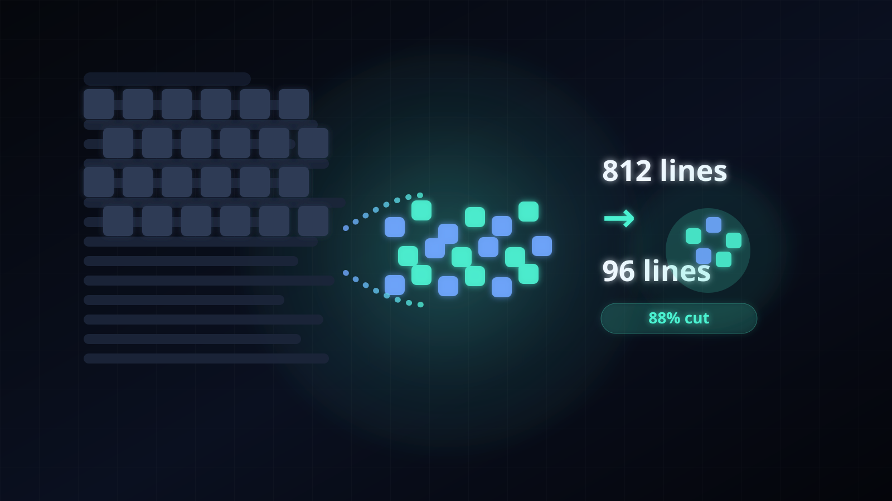

# token-reducer
Cut log noise before Claude ever sees it.

## Security notes

This script is not a sandbox. Redaction is heuristic and best-effort, so it can miss secrets or over-redact useful debug data. Do not feed it untrusted file paths from an automated or agent-driven pipeline unless you add a separate allowlist layer first.

## Project maturity

This is a new project with little history. Redaction is a heuristic, not a guarantee, so read [scripts/compress.py](scripts/compress.py) before running it on sensitive logs. Issues and PRs are welcome for review.

[](LICENSE) [](https://github.com/Da-ya7/claude-token-reducer-skill) [](https://github.com/Da-ya7/claude-token-reducer-skill/issues) [](https://claude.ai)

## Live demo


<a href="docs/index.html">
  
</a>

**[Open the live 3D demo](https://da-ya7.github.io/claude-token-reducer-skill/)**

Open the 3D collapse demo on GitHub Pages: [https://da-ya7.github.io/claude-token-reducer-skill/](https://da-ya7.github.io/claude-token-reducer-skill/)

Preview image only. The actual interactive 3D scene runs in the linked page above.

## Before / After

### Before
```text
Resolving package metadata...
Downloading wheels 12%|█████▌                          | 122/1014
Downloading wheels 13%|█████▋                          | 133/1014
Downloading wheels 13%|█████▋                          | 133/1014
test_login_flow ... ok
test_login_flow ... ok
test_login_flow ... ok
Traceback (most recent call last):
  File "/workspace/app/tests/test_parser.py", line 184, in test_parse
    assert output[812] == "done"
RuntimeError: failed to parse line 812
```

### After
```text
... 3 passing/ok line(s) collapsed ...
Traceback (most recent call last):
    ... 14 frame(s) omitted ...
RuntimeError: failed to parse line 812
[compress] 812 -> 96 lines (88% cut)
```

## Why this exists

Logs are token-eating garbage until you strip them down. token-reducer keeps the signal and throws away the duplicate fluff so Claude reads faster, cheaper, and with less context waste.

## Install

```bash
curl -fsSL <placeholder-raw-url> | bash
```

## Usage

```bash
python scripts/compress.py mylog.txt
```

## How it works

- Filter: drops blank lines, progress bars, separators, and other pure noise.
- Group: collapses repeated pass lines, warnings, and scattered duplicates into counts.
- Truncate: shortens long lines and trims traceback blocks to the useful frames.
- Dedupe: merges consecutive identical lines into one line with an `xN` count.

## Credits

Built by Dhayalan (aka Joy)

## License

MIT license: [LICENSE](LICENSE)
